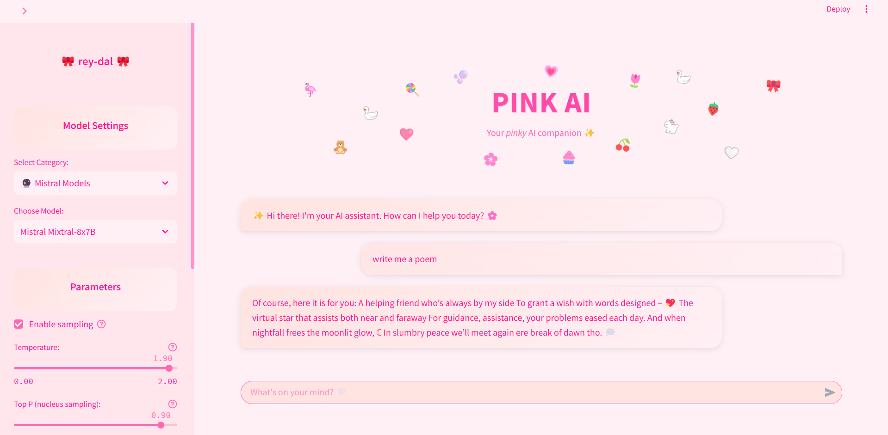

# 🎀 PINK AI

A cute chat application with a <i>pink</i>-themed interface for interacting with various language models. 



## ✨ Features

- **Supported Models:**
  - 🦙 **Llama 3 Models**: Llama 3.1 (70B), Llama 3.2 (70B), Llama 3.3 (70B)
  - 🦙 **Llama 2 Models**: Llama 2 (7B), Llama 2 (13B), Llama 2 (70B)
  - 🔮 **Mistral Models**: Mistral 7B, Mistral Mixtral-8x7B, Mistral 13B
  - 🤖 **GPT Models**: GPT-2, GPT-Neo

- **Customizable Parameters:**
  - 🌡️ **Temperature**: Default 0.1
  - 🎯 **Top P**: Default 0.95
  - 🔝 **Top K**: Default 40
  - 📏 **Max Length**: Default 2048 - 512 for GPT models
  - 🔄 **Repetition Penalty**: Default 1.2
  - 🎲 **Do Sample**: Enable/disable sampling

- **Pink User Interface:**
  - 💕 Pink color scheme throughout
  - 🌸 Gradient backgrounds (#FFE4E1 to #FFF0F5)
  - 🎀 Cute emojis and decorative elements

## 🚀 Installation

1. **Install requirements:**
```bash
pip install -r requirements.txt
```

2. **Set up your Hugging Face API token:**
   - Create `.streamlit/secrets.toml`:
   ```toml
   HUGGINGFACE_API_TOKEN = "hf_your_token_here"
   ```
   - Or create `.env` file:
   ```env
   HUGGINGFACE_API_TOKEN=hf_your_token_here
   ```

3. **Launch the app:**
```bash
streamlit run app.py
```
## 💫 Usage Tips

- Start with default parameters for the best initial experience
- For more creative responses, increase temperature (0.7-0.9)
- For factual responses, keep temperature low (0.1-0.3)
- Adjust max length based on your needs
- Try different models to compare their capabilities

## 🙏 Acknowledgements

- [Meta AI](https://ai.meta.com/) for the Llama models
- [Mistral AI](https://mistral.ai/) for the Mistral models
- [Hugging Face](https://huggingface.co/) for model hosting and API
- [Streamlit](https://streamlit.io/) for the web framework
